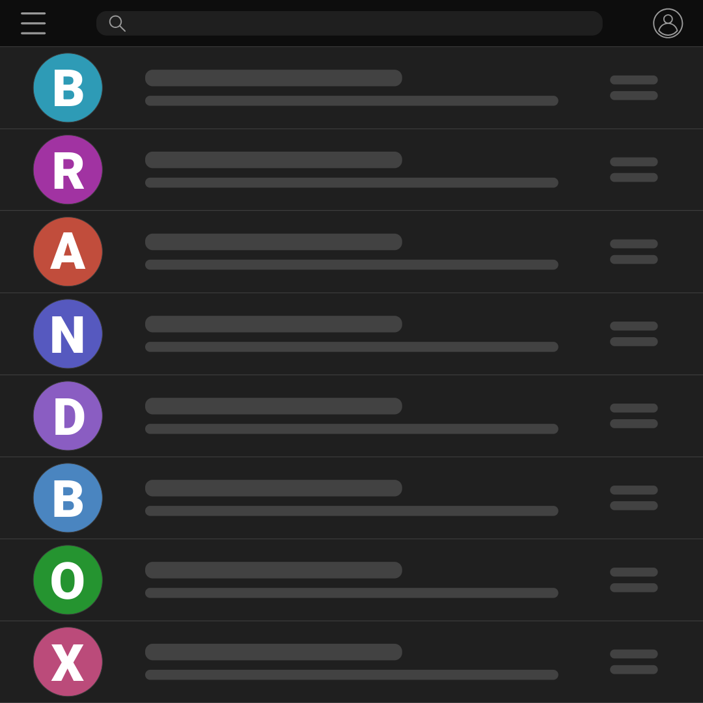

<div align="center">
  <picture>
    <source media="(prefers-color-scheme: dark)" srcset="docs/assets/brand/logo.svg">
    
  </picture>

# BrandBox

### Ditch the colored circles, add some branding to your inbox.

[![License: MIT][license-badge-icon]][license-badge-link]
[![Python Versions][python-badge-icon]][python-badge-link]
[![Codecov][codecov-badge-icon]][codecov-badge-link]
[![CI Build][ci-badge-icon]][ci-badge-link]

[![PyPI Version][pypi-version-badge-icon]][pypi-badge-link]
[![PyPI - Downloads][pypi-downloads-badge-icon]][pypi-badge-link]

<p>
  <a href="docs/microsoft.md">Microsoft Setup</a> &nbsp;·&nbsp; <a href="docs/google.md">Google Setup</a> &nbsp;·&nbsp; <a href="https://github.com/divisionseven/brandbox/issues">Report Bugs</a> &nbsp;·&nbsp; <a href="https://github.com/divisionseven/brandbox/issues/new">Request Features</a>
</p>

</div>

## Why It Exists

Every version of Outlook and Gmail shows a colored circle with the sender's initials next to their name. When your inbox is full of "JD", "AS", and "MT", you're left squinting at colored circles trying to remember who's who.

**BrandBox fixes that.** It fetches each sender's company logo and uploads it as their contact photo via the Microsoft Graph API and Google People API. It works at the account backend level, so logos propagate everywhere automatically — desktop Outlook, Outlook on the web, Gmail mobile, Google Contacts, and all other connected clients.

**No more colored circles. Just recognizable brand logos in your inbox.**

## Features

| Feature                    | Description                                                                |
| -------------------------- | -------------------------------------------------------------------------- |
| **Logo Injection**         | Replaces generic initials with real company logos in Outlook and Gmail     |
| **Cross-Client Sync**      | Logos appear on desktop, web, and mobile — set once at the API level       |
| **Smart Logo Pipeline**    | Three-tier fallback: LogoKit → Brandfetch → Google favicon                 |
| **Smart Image Processing** | Auto-crops transparency, pads to 200×200, centers on transparent canvas    |
| **Multi-Provider**         | Microsoft 365, Outlook.com, Hotmail, Gmail, Google Workspace — all at once |
| **Local Privacy**          | All data stays on your machine; nothing leaves except API calls for photos |
| **Incremental Runs**       | Logo cache and contact state tracking make repeat runs near-instant        |
| **Inbox Scan**             | Optionally creates contacts for recent senders (only when a logo is found) |

## Compatibility

| Provider      | Supported account types                                                |
| ------------- | ---------------------------------------------------------------------- |
| **Microsoft** | Microsoft 365 work/school, Personal/Family, Outlook.com, Hotmail, Live |
| **Google**    | Gmail (personal), Google Workspace (business)                          |

> On-premises Exchange (non-hybrid) and IMAP/POP3 accounts are not supported. If you have Gmail connected inside Outlook, add it separately as a Google provider account — see the [Google setup guide][docs-google-link].

Both providers can run simultaneously. brandbox processes all authenticated accounts in a single `--run`.

## Requirements

- **Python 3.11+**
- A free **Azure App Registration** for Microsoft 365 accounts → [full setup guide][docs-microsoft-link]
- A free **Google Cloud project** for Gmail / Workspace accounts → [full setup guide][docs-google-link]

## Installation

### With uv (recommended)

```bash
uv tool install brandbox
```

### With pip

```bash
pip install brandbox
```

### From source

```bash
git clone https://github.com/divisionseven/brandbox
cd brandbox
uv sync
uv run brandbox --help
```

### Verify

```bash
brandbox --version
# Output: brandbox <version>
```

## Setup

<details>
<summary><b>Microsoft 365 Setup</b> — Azure App Registration</summary>

1. Follow the [Microsoft setup guide][docs-microsoft-link] to create an Azure App Registration
2. Copy the **client ID** from the Azure portal
3. Set the environment variable:

```bash
export BRANDBOX_CLIENT_ID="your-client-id-here"
```

Add to `~/.zshrc` or `~/.zshenv` to persist across shell sessions. See the [Microsoft setup guide][docs-microsoft-link] for the recommended macOS Keychain approach.

</details>

<details>
<summary><b>Google / Gmail Setup</b> — Google Cloud Project</summary>

1. Follow the [Google setup guide][docs-google-link] to create a Google Cloud project and download OAuth credentials
2. Set the path to your credentials JSON file:

```bash
export BRANDBOX_GOOGLE_CREDENTIALS="$HOME/.config/brandbox/google_credentials.json"
```

Add to `~/.zshrc` or `~/.zshenv` to persist across shell sessions.

</details>

## Usage

### Add an account

Authenticate your first account. You'll be prompted to choose a provider:

```bash
brandbox --add-account
```

Or specify the provider directly:

```bash
brandbox --add-account --provider microsoft
brandbox --add-account --provider google
```

A browser window (Google) or device code prompt (Microsoft) will guide you through sign-in. Repeat for each account across both providers.

### List accounts

```bash
brandbox --list-accounts
```

### Run logo injection

Process all authenticated accounts and inject logos:

```bash
brandbox --run
```

**Expected output:**

```
  ┌──────────────────────────────────────────────────┐
  │ brandbox  v0.1.0                                 │
  │ Inject company logos into Outlook and Gmail      │
  └──────────────────────────────────────────────────┘

  ── you@company.com  ·  Microsoft 365  ·  1 of 1 ──

  Contacts   147 found

  Processing contacts ━━━━━━━━━━━━━━━━━━━━━━━━━━━━━━ 147/147 15s
  ✓  Alice Johnson         company.com
  ✓  Bob Smith             acmecorp.com
  ·  Charlie Davis         gmail.com          (personal domain)
  ✗  Diana Lee             corp.org           (upload failed)
  ✓  Eve Williams          example.io
  ...

  ✓  118 set  ·  22 already processed  ·  4 no logo  ·  2 personal domain  ·  1 failed
```

### Also create contacts for recent senders

Logos only show for people already in your contacts. This flag scans recent inbox senders and creates a contact for each one — but only if a logo can be found first. No logo = no contact created.

```bash
brandbox --run --scan-inbox
```

### Preview without making changes

```bash
brandbox --run --dry-run
```

### Re-process contacts that already have logos

```bash
brandbox --run --overwrite
```

### Refresh all logos from scratch

Clears the cached logo files and re-fetches everything on the next run:

```bash
brandbox --clear-cache --run
```

### Reset processed-contact state

Forces brandbox to re-evaluate every contact on the next run:

```bash
brandbox --reset-state --run
```

### Show data directory

```bash
brandbox --data-dir
```

---

## Command Reference

<details>
<summary><b>Click to expand full command reference</b></summary>

| Flag                                 | Description                                              |
| ------------------------------------ | -------------------------------------------------------- |
| `--add-account`                      | Authenticate a new account                               |
| `--add-account --provider microsoft` | Authenticate a Microsoft 365 account                     |
| `--add-account --provider google`    | Authenticate a Google / Workspace account                |
| `--list-accounts`                    | List all authenticated accounts                          |
| `--run`                              | Inject logos for all accounts                            |
| `--run --dry-run`                    | Preview without making changes                           |
| `--run --overwrite`                  | Re-process contacts that already have logos              |
| `--run --scan-inbox`                 | Also create contacts from recent senders (logo required) |
| `--clear-cache`                      | Delete all cached logos (re-fetched on next `--run`)     |
| `--reset-state`                      | Reset processed-contact state (re-evaluate all contacts) |
| `--data-dir`                         | Show the brandbox data directory path                    |
| `--version` / `-V`                   | Print version number                                     |

### Environment variables

| Variable                      | Description                                       |
| ----------------------------- | ------------------------------------------------- |
| `BRANDBOX_CLIENT_ID`          | Azure App Registration client ID (Microsoft auth) |
| `BRANDBOX_GOOGLE_CREDENTIALS` | Path to Google OAuth credentials JSON file        |

</details>

## After Running

Outlook and Gmail cache contact photos and won't show updates until they reload:

| Client              | What to do                                  |
| ------------------- | ------------------------------------------- |
| Outlook for Mac     | Quit fully (`⌘Q`) and reopen                |
| Outlook for Windows | Close fully and reopen                      |
| Outlook on the web  | Hard-refresh (`⌘+Shift+R` / `Ctrl+Shift+R`) |
| Outlook mobile      | Close and reopen the app                    |
| Gmail (web)         | Hard-refresh the page                       |
| Gmail mobile        | Close and reopen the app                    |
| Google Contacts     | Logos appear immediately after running      |

## Data & Privacy

All data is stored locally on your machine:

| Platform | Path                                      |
| -------- | ----------------------------------------- |
| macOS    | `~/Library/Application Support/brandbox/` |
| Windows  | `%LOCALAPPDATA%\brandbox\brandbox\`       |
| Linux    | `~/.local/share/brandbox/`                |

Run `brandbox --data-dir` to see the exact path. The data directory contains:

- **`cache/`** — Cached logo PNG files (and `.miss` sentinel files for domains with no logo)
- **`tokens/`** — OAuth refresh tokens (keep private — never commit to version control)
- **`state.json`** — Tracked set of contacts that have already been processed

> **Keep the `tokens/` directory private.** It contains OAuth refresh tokens. Never commit it to version control.

brandbox only transmits data to:

1. **Provider APIs** (Microsoft Graph / Google People) — to fetch contacts and upload photos
2. **Logo APIs** (LogoKit, Brandfetch, Google favicon) — to fetch logo images

Nothing else leaves your machine.

See our [security documantation][security-docs-link].

## Testing

```bash
# Using uv (recommended)
uv run pytest tests/ -v

# Using pip
pytest tests/ -v
```

## Contributing

Contributions are welcome! Please open an issue before submitting a large PR to discuss your proposed changes.

```bash
git clone https://github.com/divisionseven/brandbox
cd brandbox
uv sync
uv run brandbox --help
```
See our [Contributing Guide][contributing-link].

Run the linter and type checker before submitting:

```bash
uv run ruff check src/
uv run mypy src/
```

## License

Distributed under the [MIT License][license-link].

<!-- Badge Links -->
[python-badge-icon]: https://img.shields.io/pypi/pyversions/brandbox?logo=python&style=plastic&color=black&logoColor=white&label=Python
[python-badge-link]: https://www.python.org/
[license-badge-icon]: https://img.shields.io/badge/license-MIT-blue?style=plastic&logo=open-source-initiative&color=black&logoColor=white&label=License
[license-badge-link]: https://opensource.org/licenses/MIT
[codecov-badge-icon]: https://img.shields.io/codecov/c/github/divisionseven/brandbox?logo=codecov&style=plastic&color=black&logoColor=white&label=Codecov
[codecov-badge-link]: https://app.codecov.io/gh/divisionseven/brandbox
[ci-badge-icon]: https://img.shields.io/github/actions/workflow/status/divisionseven/brandbox/ci.yml?branch=main&logo=github&style=plastic&color=black&logoColor=white&label=Build
[ci-badge-link]: https://github.com/divisionseven/brandbox/actions/workflows/ci.yml

[pypi-version-badge-icon]: https://img.shields.io/pypi/v/brandbox?style=plastic&color=black&logo=pypi&logoColor=white&label=Pypi%20Version
[pypi-downloads-badge-icon]: https://img.shields.io/pypi/dm/brandbox?style=plastic&logo=pypi&logoColor=white&label=Downloads&color=black
[pypi-badge-link]: https://pypi.org/project/brandbox/

<!-- Documentation Links -->
[docs-google-link]: docs/google.md
[docs-microsoft-link]: docs/microsoft.md
[contributing-link]: CONTRIBUTING.md
[security-docs-link]: .github/SECURITY.md
[license-link]: LICENSE
